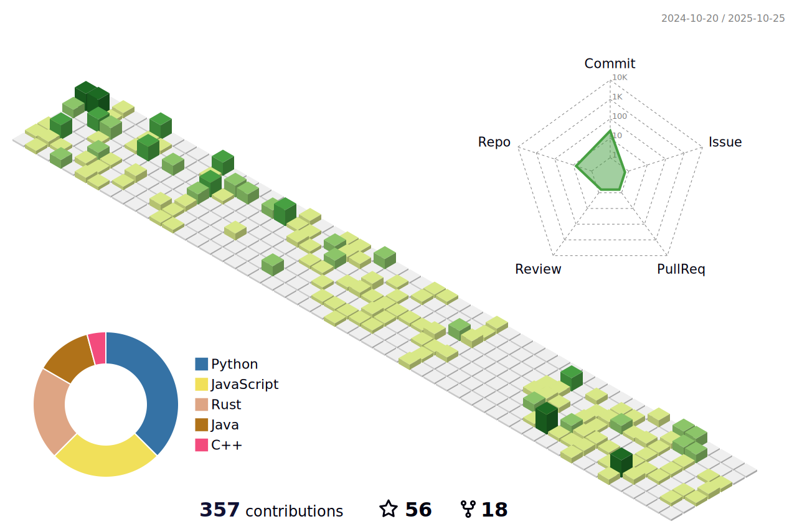

### Hi there 👋   I am Somade Daniel, I am a software engineer (obviously 😂).

- I specialize in Frontend Web Development using ReactJs.</li>
- I have experience in Backend developement using Php and MySQL.</li>
- I also have experince in embedded system using C/C++ and Python, I have built things with Node MCU and OrangePi.</li>
- I am familiar with the shell and bash scripting.</li>

<h3><a href="https://somadedaniel.netlify.app/">Click this link to check out my Portfolio 🙃🙃</a></h3>

<h3 align="left">Connect with me:</h3>

  
  
  
  
  

 

<!-- 
- 🔭 I’m currently working on ...
- 🌱 I’m currently learning ...
- 👯 I’m looking to collaborate on ...
- 🤔 I’m looking for help with ...
- 💬 Ask me about ...
- 📫 How to reach me: ...
- 😄 Pronouns: ...
- ⚡ Fun fact: ...

 

 

-->
